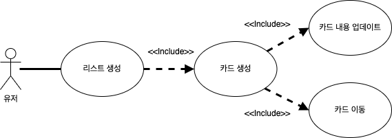

목차

- [명세 분석](#명세-분석)
  - [개발 순서 정리](#개발-순서-정리)
    - [0. 작업 히스토리 관리 전략 수립](#0-작업-히스토리-관리-전략-수립)
    - [1. 요구사항 분석 및 작성](#1-요구사항-분석-및-작성)
    - [2. 유스케이스 작성](#2-유스케이스-작성)
    - [3. 와이어 프레임 & 유저 플로우 작성](#3-와이어-프레임--유저-플로우-작성)
    - [4. 기능 명세서 작성](#4-기능-명세서-작성)
    - [5. 데이터 모델링](#5-데이터-모델링)
    - [6. 프로젝트 설계(스캐폴딩)](#6-프로젝트-설계스캐폴딩)
  - [개발 순서별 모호한 부분 정리](#개발-순서별-모호한-부분-정리)
    - [0. 작업 히스토리 관리 전략 수립](#0-작업-히스토리-관리-전략-수립-1)
    - [1. 요구사항 분석 및 작성](#1-요구사항-분석-및-작성-1)

<br>

---

<br>

# 명세 분석

```
1. 제시 영상으로부터 이 과제를 수행하기 위해 만들어야 했던 것들 요약
2. 애매하거나 모호한 부분이 있다면, 어떤 안으로 만들기로 결정했는지를 이유 설명
```

요약

```

```

---

<br>

## 개발 순서 정리

<br>

### 0. 작업 히스토리 관리 전략 수립

- 프로젝트 작업에 대한 히스토리를 체계적으로 남기기 위한 전략 수립 과정
- 히스토리와 관련된 별도의 문서 없이, git history 기능을 사용하기로 결정
- 체계적으로 남기기 위한, git message 작성에 대한 규칙 수립 (ref. https://cbea.ms/git-commit/)

<br>
<br>

### 1. 요구사항 분석 및 작성

요구사항은 다음과 같은 토대로 분석되었습니다.

- 유튜브 영상 "What's Trello Tutorial"에서 0:46부터 1:56까지 나오는 화면과 영상 해설
- 과제물 안내 문서

`용어`

```
유저(User): 해당 웹 애플리케이션을 사용하는 사용자
리스트(List): 진행해야할 작업 테마
카드(Card): 작업 테마에서(List) 처리되어야하는 작업
보드(Board): 목록, 카드가 기록되는 곳
```

`기능적 요구 사항`

```
1. 유저는 보드에 새로운 리스트를 생성할 수 있습니다.
2. 유저는 한 리스트에 새로운 카드를 한 개 이상 추가할 수 있습니다.
3. 유저는 생성된 카드의 내용을 업데이트할 수 있습니다. (유튜브 영상의 해설에서 "Each card can be customized and updated")
4. 유저는 리스트에 포함된 카드를 다른 리스트로 옮길 수 있습니다.
5. 유저는 A 브라우저에서 추가했던 리스트와 카드는 다른 B 브라우저에서 접속해도 볼 수 있어야 합니다.
```

`비기능적 요구 사항`

```
1. 개발될 웹 애플리케이션은 Chromium 87 이상 브라우저, FireFox 92 이상 브라우저, Safari 15 브라우저를 지원할 수 있어야 한다.
2. 웹 서버 개발 시에 Node.js LTS 16.13 버전 이상, Express 4.17.1 버전 이상만 사용한다.
3. 웹 페이지를 작성할 때에는 ECMAScript 라이브러리는 사용할 수 없다.
4. 웹 페이지를 작성할 때에는 CSS 외부 라이브러리는 폰트나 아이콘을 제공하는 것외에는 사용할 수 없다.
5. 웹 페이지를 작성할 때에는 SASS 등의 전처리기는 사용할 수 없다.
6. 프로젝트의 작업 과정은 .git 디렉토리내에 포함되어야한다.
7. 웹서버를 재시작했을 때, 변경 내용이 꼭 유지될 필요는 없다.
```

<br>
<br>

### 2. 유스케이스 작성



### 3. 와이어 프레임 & 유저 플로우 작성

### 4. 기능 명세서 작성

### 5. 데이터 모델링

### 6. 프로젝트 설계(스캐폴딩)

---

<br>

## 개발 순서별 모호한 부분 정리

### 0. 작업 히스토리 관리 전략 수립

<br>

| 고민                                             | 결정                                   | 이유                                                                                                            |
| ------------------------------------------------ | :------------------------------------- | :-------------------------------------------------------------------------------------------------------------- |
| 별도의 git 브랜치를 만들어야하나 (git flow 전략) | 별도의 git 브랜치를 만들지 않기로 결정 | 협업하지 않는 상황에서는 브랜치를 분할하는것은 테스크 오버헤드라고 판단함, git commit message로 충분하다고 판단 |

<br>

### 1. 요구사항 분석 및 작성

<br>

| 고민                                                                  | 결정 | 이유 |
| --------------------------------------------------------------------- | :--- | :--- |
| 유저가 보드에 계속해서 리스트를 추가한다면?                           | --   | ---  |
| 유저가 보드에 기존에 있는 리스트 이름으로 새로운 리스트를 추가한다면? | --   | ---  |
| 유저가 리스트에 계속해서 카드를 추가한다면?                           | --   | ---  |
| 유저가 한 리스트에 같은 이름의 카드를 추가한다면?                     | --   | ---  |
| 보드에서 제공하는 디폴트 리스트를 제공해야하나?                       | --   | ---  |
