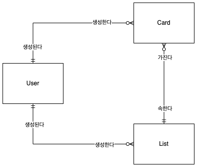
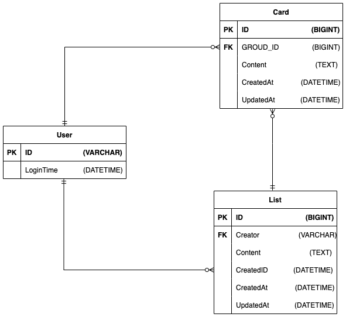
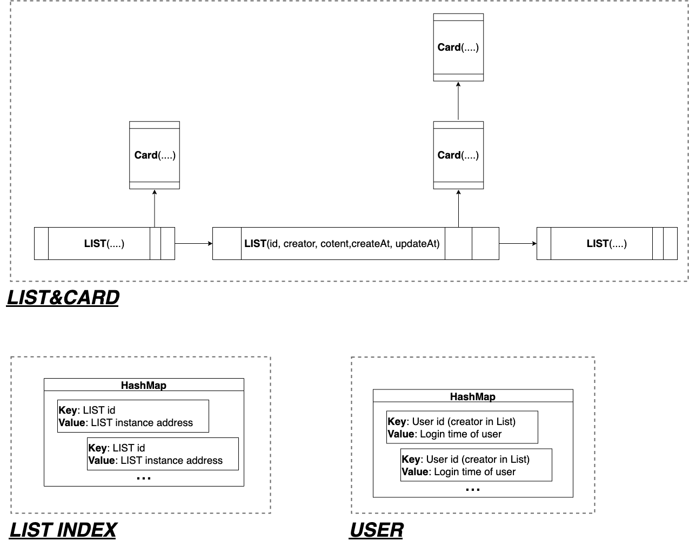

목차

- [설계 주안점](#설계-주안점)
- [데이터 모델링](#데이터-모델링)
- [프로젝트 구조 설계(스캐폴딩)](#프로젝트-구조-설계스캐폴딩)

<br>

---

<br>

# 설계 주안점

0. 역할과 구현을 분리하여, 확장 가능한 설계 지향하기
1. 코드의 재사용과 가독을 올리기 위한 관심사 분리 원칙 지키기
2. 백엔드 개발: 항상 서버를 공격하는 악의적인 사용자가 있다고 염두하면서 설계 및 프로그래밍하기
   - 악의적인 유저가 계속 보드를 생성하는 요청을 보내는 걸 방지

<br>

# 데이터 모델링

```
- 서버 측에 데이터를 저장하기 위한 저장소가 필요한 상황
- 현재로서는 정해진 저장소 타입이 없고, 대용량의 데이터나 속도가 우선시 되어야하는 상황이 아니기 때문에 비관계형 DB보다는 안정성이 좋은 RDB를 선택한다고 가정
```

## ERD 다이어그램

### 개념적 데이터모델



참고) 개념적 데이터 모델링 단계에서 엔티티의 속성을 제외한 이유

```
엔티티 간의 관계에만 집중하기 위해서입니다.
지금 같이 작은 규모에서는 관계와 속성을 보기에는 불편하지는 않지만, 규모가 커진다면 엔티티의 특성 때문에 관계를 한눈에 보기가 어려워집니다. 또한, 엔티티의 특성은 요구사항에 따라 언제든지 추가되거나 바뀌는 반면에 엔티티의 관계는 잘 변하지 않는 이유도 있습니다.
```

### 논리적 데이터모델



## 로컬 메모리데이터베이스의 구조

- 고려사항: 리스트와 카드는 빈번히 삽입, 삭제, 수정이 일어날 수 있다. 만약 악의적인 유저로 인하여 리스트와 카드가 많이 저장된 상태에서, 아주 빈번히 리스트 혹은 카드 내용이 변경된다면
- 그렇기에 로컬 메모리 데이터베이스에 데이터를 관리하는 구조를 링크드 리스트로 선택
- 삽입 및 삭제가 빠른 링크드 리스트 자료구조 선택(search하는 시간은 서버 단에서 연산은 거의 일어나지 않기 때문에, O(1) 예상)
- 또한, 링크드 리스트의 검색 속도를 보완하기 위하여, 보조 자료구조로 해시 테이블 사용(Key: 리스트 고유 아이디, Value: 리스트 인스턴스 위치 )



로컬 메모리 데이터베이스의 물리적인 구조는 크게 3가지로 구성된다.

- `LIST&CARD`: 리스트와 카드들이 연결 리스트가 저장되는 곳 (수정)
- `LIST INDEX`: 특정 리스트를 빨리 찾기 위하여, 리스트의 아이디와 리스트의 인스턴스 레퍼런스가 키-값 형태로 저장되는 곳
- `USER`: 익명 사용자가 저장되는 곳

<br>

# 시스템 아키텍처

3-layer 아키텍처, MVC 패턴

- 일반적으로 많이 사용하는 아키텍처와 디자인패턴이라서, 다른 개발자가 해당 웹 서비스의 전체 구조를 쉽게 이해할 수 있다.
- 각 레이어마다 고유한 책임을 부여하여, 문제되는 계층만 독립적으로 해결할 수 있다.
- 코드를 수정할 때, 유지보수하기 쉽다

<br>

# 프론트&백엔드

개발 진행할 때, 프론트 영역과 백엔드 영역으로 나누어서 생각

프론트 영역

- 리스트와 카드의 생성, 위치, 수정이 빈번히 일어나기 때문에 서버 사이드 렌더링은 적합하지 않을 수 있다.
- 그렇기에 브라우저에서 실행되는 애플리케이션을 서버가 브라우저로 던져주고 나서는 클라이언트 사이드 렌더링되도록 코드 작성

백엔드 영역

- 서버는 HTTP API 기반으로 동작하도록, 프로그램 작성

# 보안

- csrf 공격
- 전처리 유효성 검사

# 프로젝트 구조 설계

스캐폴딩 초안

```
project
|
|-- public : 정적 자원
|     |_css
|     |_js
|     |_template
|     |_index.html
|
|-- src : API 서버 관련 소스코드
|    |
|    |_api (도메인 별로 정리)
|       |_domainA
|       |   |____entity
|       |   |____controller
|       |   |____repository
|       |   |____service
|       |
|       |_domainB
    |
    |__ common: 도메인에서 사용하는 exception 처리와 같은 공통 모듈
    |    |_exception
    |
    |__ lib:
    |    |
    |    |_database
    |    |
    |    |_repository
    |    |
    |    |_model
    |
    |__ middleware: 핸들러 메서드에 오기전에 전처리와 관련된 모듈
    |     |_xxx.middleware
    |
    |__ app.js: express 서버
    |__ server.js: express 서버를 시작하는 시작점
|
|_test
   |_api: e2e 테스트
   |_lib: 테스트에 필요한 셋팅
   |_test.config.json
|
|_.env
|_.gitignore
|_package.json
|_README.md
```

# 고민

- MVC 패턴과 3-layer 아키텍처를 제대로 알고 쓰는 걸까?
